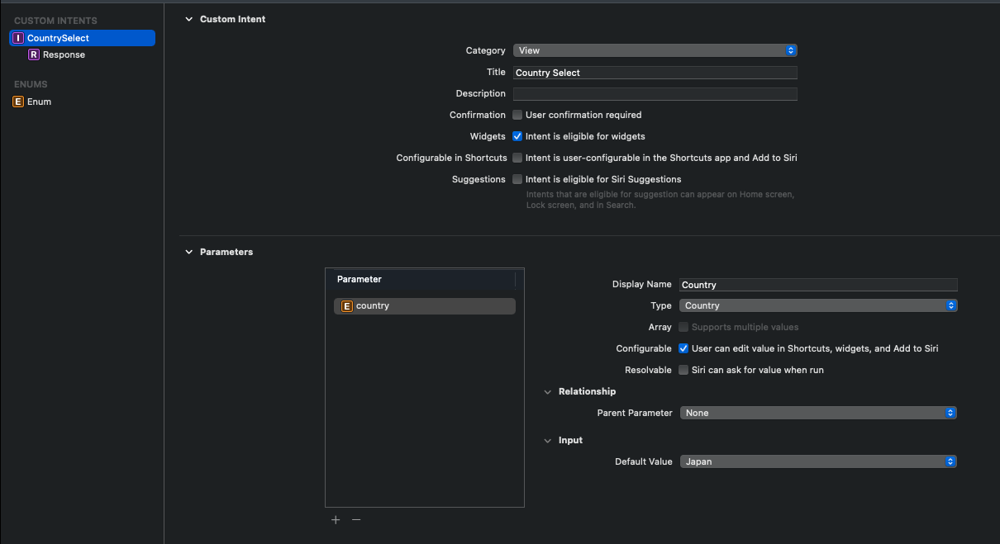
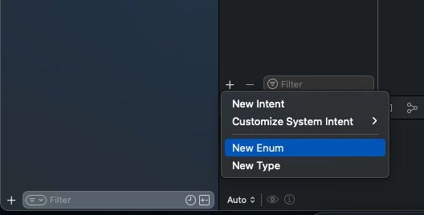
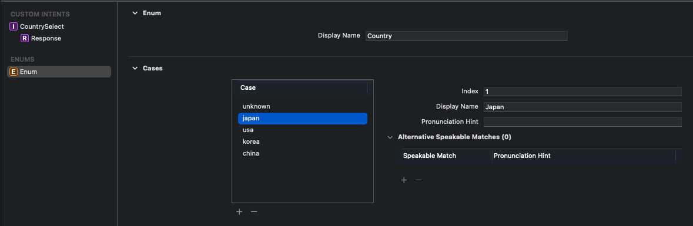
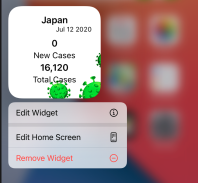
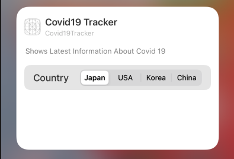

## Widgetを作るまとめ

今回は、新型コロナの感染情報を表示する簡単なWidgetを作成してみたいと思います。まずは、国の感染情報を表示できるようにします。

AppにWidgetを追加すするために新しいTargetを追加する必要あります。

追加方法：

- XcodeでFile > New > Target
- Application Extension GroupからWidget Extension を選択して、次を押す
- 名前を入力
- user-configurable propertiesある場合は、Configuration Intentにチェックを入れる
- Finishを押す

#### Widgetのエントリポイント

@mainのキーワードをついているstructがWidgetのエントリポイントになります。そのstructはWidgetプロトコルを準拠している必要があります。

```swift
@main
struct Covid19TrackerWidget: Widget {
    private let kind: String = "Covid19TrackerWidget"

        public var body: some WidgetConfiguration {
            StaticConfiguration(kind: kind,
                                provider: Covid19CountryStatusProvider(),
                                placeholder: PlaceholderView())
            { entry in
                Covid19CountryStatusEntryView(entry: entry)
            }
            .configurationDisplayName("Covid19 Tracker")
            .description("Shows Latest Information About Covid 19")　
        }
}
```

Widget作成ためには上通りに書きます。bodyの型はWidgetConfigurationになっています。WidgetConfigurationは、このWidgetとは何か、どのように構築されるかを示しますが。

#### WidgetConfiguration

WidgetConfigurationは二種類あります

- StaticConfiguration
- IntentConfiguration

#### StaticConfiguration

`init(kind: String, provider: TimelineProvider, placeholder: View, content: (TimeLineEntry) - _)`

ユーザー設定可能なプロパティ（user-configurable properties）ない場合


#### IntentConfiguration

`IntentConfiguration(kind: String, intent: INIntent.Type, provider:IntentTimelineProvider, placeholder: View, content: (TimelineEntry) -> _)`

ユーザー設定可能なプロパティ（user-configurable properties）ある場合。プロパティを定義するためはSiriKit custom intentを利用します。


##### IntentConfigurationとStaticConfigurationのinitの違い

- IntentConfigurationではproviderがTimelineProviderではなくIntentTimelineProvider利用します。
- INIntent.Type型の引数が追加で必要

#### Configurationの引数について

- kind

  Widgetを識別する文字列。基本的にSwiftファイル名と同じ

  ```swift
  FileName: Covid19TrackerWidget.swift 
  @main
  struct Covid19TrackerWidget: Widget {
      private let kind: String = "Covid19TrackerWidget"
    ...省略...
  ```

- TimelineProvider

  Widgetのコアなエンジンになります。Widgetでは常にExtensionを実行しているのではなく、OSが（時間、日、週）単位で表示する必要があるイベントのTimelineを一度に提供します。

  Timeline作成には、ますTimelineEntryを定義します。

  - TimelineEntry:

    TimelineEntryはEntryがWidgetにいつレンダリングされるかDateを指定が必須です。そして、必要な追加情報を含めることもできます。

    ```swift
    struct Covid19CountryStatusEntry: TimelineEntry {
        public let date: Date　//いつレンダリングされるか
        public let status: Covid19CountryStatus // 追加情報（Widget内容表示に利用）
    }

    ```


  TimelineProviderプロトコルには、2つのメソッドを実装する必要あります。

  - snapshot(with context:completion:)

    ホーム画面でWidget追加時Widget選択画面にWidgetがどのように見えるか表示するためのpreview。snapshot作成時completionができるだけ早く実行されて、Widget内の情報が表示される必要があります。数秒以上かかる場合Dummyのデータを提供することがおすすめされています。

    ```swift
      func snapshot(with context: Context, completion: @escaping (Covid19CountryStatusEntry) -> ()) {
            let dummy = Covid19CountryStatus.default
            let entry = Covid19CountryStatusEntry(date: Date(), status: dummy)
            completion(entry)
        }
    ```
    

  - timeline(with context:completion)

    Widgetが使用する実際の情報を定義します。Timelineの役割は

    1. 表示するすべてのEntriesを持つ、Timelineインスタンスを返します。
    2. Timelineの期限切れ時間 / 次いつRefreshされるかの時間

    以下では、一つのEntryを作成し５分毎にRefreshするように指定しいます。５分毎にRefresh指定はpolicyプロパティでやります。policy(RefreshPolicy)は現在のTimelineを破棄し、新しTimeline取得するタイムも定義します。policyは以下のどちらか指定できます。　

    1. never: refreshしない、変化しない静的コンテンツを表示
    2. atEnd: Timelineの最後のEntryが表示されたとき
    3. .after(Date):  指定の時間後

    （注意：新しTimeline取得後、Widgetにすぐに反映されるとは限りません。多少時間かかります。反映されるまでの時間は、ユーザーがどれだけWidgetを見ているかが大きく影響します。）

    

    timeline()では、Widgetに表示する本当のデータを処理しますので通信などもこちらでやっています。

  ```swift
  func timeline(with context: Context, completion: @escaping (Timeline<Covid19CountryStatusEntry>) -> ()) {
        let currentDate = Date()
        let refreshDate = Calendar.current.date(byAdding: .minute, value: 5, to: currentDate)!
        
        Covid19DataLoader.fetch { (result) in
            let country: Covid19CountryStatus
            switch result {
            case .success(let fetchedData):
                country = fetchedData
            case .failure:
                country = Covid19CountryStatus.default
            }
            
            let entry = Covid19CountryStatusEntry(date:currentDate, status: country)
            let timeline = Timeline(entries: [entry], policy: .after(refreshDate))
            
            completion(timeline)
        }
    }
  ```


- PlaceHolder

  Widgetの一番最初のレンダリング時（まだ表示データが取得できない時）に表示されるView。`isPlaceHolder(true)`modifierを利用すると便利。そうすることでView内のTextやImageが長方形のViewに自動的に変更されます。

  ```swift
  struct PlaceholderView: View {
      var body: some View{
          CountryStatusWidgetView(country: Covid19CountryStatus.default)
              //.isPlaceholder(true)  //Xcode12betaで試してみましたが　`Value of type XXX　has no member isPlaceholder`とエラーになりました。
      }
  }

  ```

- Content Closure

   Widgetに表示するためのSwiftUI Viewを持つClosure。ProviderからTimelineEntryを渡し、Widgetのをレンダリングします。

#### Widgetにコンテンツを表示する

WidgetはSwiftUIのViewを利用します。WidgetのConfigurationには、WidgetのコンテンツをレンダリングするためにWidgetKitが呼び出すクロージャーが含まれています。

```Swift
struct Covid19CountryStatusEntryView: View {
    var entry: Covid19CountryStatusProvider.Entry
    
    var body: some View{
        CountryStatusWidgetView(status: entry.country)
    }
}
```

#####  WidgetのSize別に違うLayoutを表示する

WidgetのSize別に違うLayoutを表示するために、@Environment Property Wrapper に新しく追加された(\.widgetFamily)を利用きます。WidgetのSizeによってViewの型の違うため@ViewBuilderの定義も必要です。

```swift
struct Covid19CountryStatusEntryView: View {
    @Environment(\.widgetFamily) var family: WidgetFamily
    var entry: Covid19CountryStatusProvider.Entry
    
    @ViewBuilder
    var body: some View{
        switch family {
        case .systemSmall:
            CountryStatusWidgetView(status: entry.status)
        default:
            CountryStatusWidgetMediumView(status: entry.status)
        }
    }
}
```

##### 特定のWidget Familyのみサポート

特定のWidget Familyのみサポートするためには、.supportedFamilies modifierを利用します。

```swift
public var body: some WidgetConfiguration {
     StaticConfiguration(kind: kind,
        ...省略...
      ）
      .supportedFamilies([.systemSmall, .systemMedium]) // 追加
      .configurationDisplayName("Covid19 Tracker")
      .description("Shows Latest Information About Covid 19")
                         
                         
}
```

##### Deeplink

ユーザがWidgetをタップした時、WidgetKitがアプリを開き、指定のURLを渡すことができます。URLの指定はViewに.widgetURL modifier利用することでできます。

```swift
struct Covid19CountryStatusEntryView: View {
    
    @Environment(\.widgetFamily) var family: WidgetFamily
    var entry: Covid19CountryStatusProvider.Entry
    
    @ViewBuilder
    var body: some View{
        switch family {
        case .systemSmall:
            CountryStatusWidgetView(status: entry.status)
          	.widgetURL(URL(string: entry.self.status.countries.first?.country ?? "invalid country"))
        default:
            CountryStatusWidgetMediumView(status: entry.status)
        }
    }
}
```

今はアプリ自体は何も表示されていませんので、URLとして現在表示している国の名前を渡して、それを表示しています。

```Swift
//アプリ側のコード
struct ContentView: View {
    
    @State var displayText: String = "Hello World"
    var body: some View {
        Text(displayText)
            .onOpenURL { url in
            self.displayText = url.absoluteString
        }
    }
}
```

SmallWidgetをタップし、アプリを開くと以下のように国の名前が表示されます。


WidgetUrlを提供しない場合、タップされたら単にアプリ開きます。

#### Adding UserConfigurable Properties(ユーザー設定可能なプロパティ)

ユーザー設定可能なプロパティを追加するためは、SiriとShortcutを利用する際に
活用されていた技術と同じSiriKit Intent Definitionを利用します。今回はユーザにどの国の情報を表示するか選択できるようにしたいと思います。

具体的には以下のように変更します。

-  新しSiriKit Intent Definitionを追加し、プロパティの追加
-  IntentTimelineProviderを準拠指定いるオブジェクトを作る
-  WidgetのConfigirationをIntentConfigurationに変更する

##### 新しSiriKit Intent Definitionを追加し、プロパティの追加

File > New File > select SiriKit Intent Definition Fileを追加します。



新しいCustom Intentを追加後

1. CategoryはViewを選択している
2. Intent is eligible for widgetがチェックされていることを確認してます。

そして、ユーザ設定可能なプロパティとしてCountryというEnum型を設定しました。Enumの追加はEditorの右下の`+`ボタンからできます。






##### IntentTimelineProviderを準拠指定いるオブジェクトを作る

ProviderはIntentTimelineProviderを利用します。

```swift
struct Covid19CountryStatusIntentProvider: IntentTimelineProvider {
    typealias Entry = Covid19CountryStatusEntry
    typealias Intent = CountrySelectIntent
    
  ///　Intentに設定されたOptionを文字列に変換するhelper method
    func country(for configuration: CountrySelectIntent) -> String {
        switch configuration.country {
        
        case .unknown, .japan:
            return "jap"
        case .usa:
            return "usa"
        case .korea:
            return "kor"
        case .china:
            return "chi"
        }
    }
    
    func snapshot(for configuration: CountrySelectIntent, with context: Context, completion: @escaping (Covid19CountryStatusEntry) -> ()) {
        let dummy = Covid19CountryStatus.default
        let entry = Covid19CountryStatusEntry(date: Date(), status: dummy)
        completion(entry)
    }
    
    func timeline(for configuration: CountrySelectIntent, with context: Context, completion: @escaping (Timeline<Covid19CountryStatusEntry>) -> ()) {
        let currentDate = Date()
        let refreshDate = Calendar.current.date(byAdding: .minute, value: 5, to: currentDate)!
        let selectedCountry = country(for: configuration)
        
        Covid19DataLoader.fetch(by: selectedCountry) { (result) in
            let country: Covid19CountryStatus
            switch result {
            case .success(let fetchedData):
                country = fetchedData
            case .failure:
                country = Covid19CountryStatus.default
            }
            
            let entry = Covid19CountryStatusEntry(date:currentDate, status: country)
            let timeline = Timeline(entries: [entry], policy: .after(refreshDate))
            
            completion(timeline)
        }
    }
}
```

1. INIntent型の新しいassociatetype(CountrySelectIntent)
2. snapshot()timeline()に新し引数 `for configuration: CountrySelectIntent`

が追加されていることが確認できます。CountrySelectIntentは上で定義したCustom Intentでユーザ設定可能なプロパティ(Enum)をアクセルするためには`configuration.country`でアクセスします。

##### WidgetのConfigirationをIntentConfigurationに変更する

```Swift
@main
struct Covid19TrackerWidget: Widget {
    private let kind: String = "Covid19TrackerWidget"
    var body: some WidgetConfiguration {
        IntentConfiguration(kind: kind,
                            intent: CountrySelectIntent.self,
                            provider: Covid19CountryStatusIntentProvider(),
                            placeholder: PlaceholderView())
        { entry in
            Covid19CountryStatusEntryView(entry: entry)
        }
        .supportedFamilies([.systemSmall, .systemMedium])
        .configurationDisplayName("Covid19 Tracker")
        .description("Shows Latest Information About Covid 19")
    }
}
```

WidgetのConfigirationをIntentConfigurationにします。

1. Intent引数には同じCustomIntent(CountrySelectIntent.self)を渡します。
2. ProviderはIntentTimelineProviderを準拠しているオブジェクトを渡す



これで実行して、Widgetを長押ししてみると`Edit Wiget`が選択できるようになります。



そして、`Edit Wiget` を選択すると国が選択できるようになります。


#### 複数の種類のWidgetをサポート

 一つのアプリの複数種類のWidgetを作成することができます。複数種類のWidgetのためにはWidgetBundleを作成し、@mainをこちらに移動します。

もう一つ、コロナの全体情報を見れるWidget(Covid19GeneralStatsWidget)を作成しました。WidgetBundleにWidgetConfigurationを追加することだけで複数のWidgetをサポートできます

```Swift
@main
struct Covid19WidgetBundle: WidgetBundle {
    
    @WidgetBundleBuilder
    var body: some Widget {
        Covid19TrackerWidget()
        Covid19GeneralStatsWidget()
    }
    
}
```

こちらでWidgetを選択するときスワイプで追加Widgetを選択できるようになります。


#### Widgetとアプリで情報の共有

Widgetとアプリの間でデータを共有するためはAppGroups機能を利用します。

今２番目のWidget（Covid19GeneralStatsWidget）ではBackgroundないので、アプリでユーザーに画像を検索させ、画像をDirectoryに保存してそれを２番目のWidgetにBackgroundとして利用するようにしたいと思います。

（Human Interface Guidelineとしてはデイザイン的にあまり良くないですが、Directoryの共有の練習のためにやりたいと思います。）

アプリで新しいViewで画像検索機能を追加しました。


##### AppGroupsの追加

1. Target  > アプリを選択  >  Signing And Capabilities > +Capability
2. AppGroupsを追加
3. AppGroupsから`+`を押す
4. GroupにIdentifierをつけて、Groupを追加する
5. Groupにはチュックをついていることを確認する
6. 同じくTargetsからWidget Extensionでも AppGroupsを追加する。
7. Widgetではすでに同じIdentifierのGroupは表示されているのでチュック付けるだけでオッケー


##### Groupに画像を保存

1. まず、GroupのURL以下のように取得します。画像を表示するUrlImageView.swiftに以下のコードを追加

```swift
 let sharedContainerURL: URL = FileManager.default.containerURL(
        forSecurityApplicationGroupIdentifier: "group.com.binish.Covid19Tracker"
    )!
```

2. これでDirectoryのURL取得できましたので、Fileを保存できます。今回はImageをタップした時に`bg.png`という名前で保存するようにしてAlertを表示しています。

```swift
 Image(uiImage: uiimage)
     .resizable()
     .onTapGesture {
       // ファリルに画像を保存
         if let data = uiimage.pngData() {
             let filename = sharedContainerURL.appendingPathComponent("bg.png")
             try? data.write(to: filename)
             self.showAlert = true
         }
         
     }
```


##### Groupから画像を読み取り

1.同じGroupのURLを取得します。WidgetのViewを作るCovid19GeneralStatsViewに同じコードを追加sする

```swift
let sharedContainerURL: URL = FileManager.default.containerURL(
        forSecurityApplicationGroupIdentifier: "group.com.binish.Covid19Tracker"
    )!
```

2. WidgetではURLから`bg.png`を検索し、存在する場合にBackgroundとして設定するようにしています。

```swift
let sharedContainerURL: URL = FileManager.default.containerURL(
        forSecurityApplicationGroupIdentifier: "group.com.binish.Covid19Tracker"
    )!

// ファイルから画像を読みる
var bgImage: UIImage? {
    let filePath = sharedContainerURL.appendingPathComponent("bg.png")
    do {
        let data = try Data(contentsOf: filePath)
        let uiimage = UIImage(data: data)
        return uiimage
    } catch {
        return nil
    }
}

var body: some View {
    ZStack {
      // Background Image設定
        if bgImage != nil {
            Image(uiImage: bgImage!)
                .resizable()
        }
。。。省略。。。
```

これでXcodeでWidgetを実行してみるとBackgroundが設定されて、同じファイルを共有していることが確認できます。


##### UserDefaultsの場合

UserDefaultsでデータを共有したい場合は新しく追加された[@AppStorage](https://developer.apple.com/documentation/swiftui/appstorage) Propertyが利用できます。

```swift
@AppStorage("key", store: UserDefaults(suiteName: "group.com.binish.Covid19Tracker"))
    var userData: String = ""
```

#### App-Driven Reloads/WidgetCenter

Widgetを立ち上がった状態でもう一度新しい画像を保存してみましょう。保存が成功してAlertが出てもWidgetのBackgroundが変更されません。

それは、Widgetが５分毎にReloadされるように設定されてBackgroundが反映されるのに次のReloadを待つ必要あります。画像保存後、すぐにBackroundを反映するためにはアプリからWidgetを明示的に更新する（App-Driven Reload）必要があります。

アプリからWidgetを明示的にReloadするために[WidgetCenter](https://developer.apple.com/documentation/widgetkit/widgetcenter)を使用します。

WidgetCenterは

1. [`reloadTimelines(ofKind:)`](https://developer.apple.com/documentation/widgetkit/widgetcenter/reloadtimelines(ofkind:)) : アプリに紐づいている特定のWidgetのみを更新することできます
2. [`reloadAllTimelines()`](https://developer.apple.com/documentation/widgetkit/widgetcenter/reloadalltimelines()) : 全てのWidgetを更新することができます
3. [`getCurrentConfigurations(completion:)`](https://developer.apple.com/documentation/widgetkit/widgetcenter/getcurrentconfigurations(_:)) : 現在のConfigurationを取得することできます。

今回は全てのWidgetを更新する`reloadAllTimelines()`で画像保存後、Widgetを更新してみます。

```swift
Image(uiImage: uiimage)
     .resizable()
     .onTapGesture {
       // ファリルに画像を保存
         if let data = uiimage.pngData() {
             let filename = sharedContainerURL.appendingPathComponent("bg.png")
             try? data.write(to: filename)
             self.showAlert = true
           
           // 全てのWidgetを明示的に更新
           WidgetCenter.shared.reloadAllTimelines()
         }
     }
```

これでWidget立ち上がった状態でもう一度保存すると、次のReload待たなくてもすぐにBackgroundが反映されるのが確認できます。

（注意：明示的に更新するのは、Widgetに表示する内容に関連する更新が行われた際にのみです。）

#### Preview

CanvasにPreviewの表示するためにはpreviewContext ModifierでWidgetPreviewContextを渡す必要あります。

`WidgetPreviewContext(family:WidgetFamily)`

```swift
struct Covid19TrackerWidget_Previews: PreviewProvider {
    static var previews: some View {
        Covid19CountryStatusEntryView(entry: Covid19CountryStatusEntry(date:Date(),status: Covid19CountryStatus.default))
                .previewContext(WidgetPreviewContext(family: .systemSmall)))
    }
}
```

****

### 

